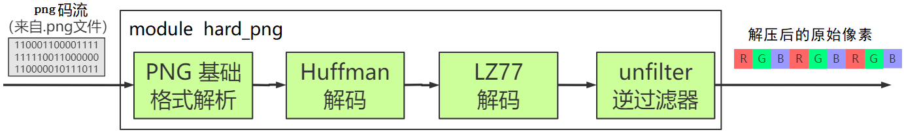
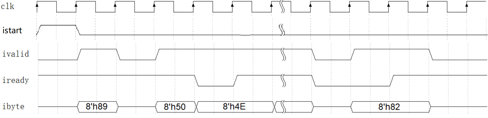
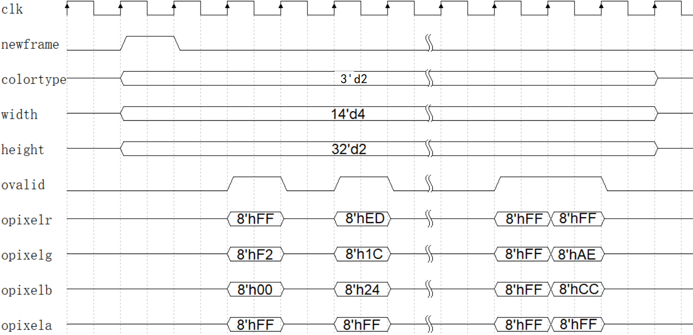

-CAD09D.svg)   

Hard-PNG
===========================
基于FPGA的流式的 **png** 图象解码器，输入 png 码流，输出原始像素

* 支持图像宽度<4000，高度不限。
* **支持所有颜色类型**：灰度、灰度+A、RGB、索引RGB、RGB+A。
* 仅支持8bit深度（大多数 png 图像都是8bit深度）。

|  |
| :----: |
| **图1** : Hard-PNG 原理框图 |


# 背景知识

png 是仅次于jpg的第二常见的图象压缩格式。png支持透明通道（A通道），支持无损压缩，支持索引RGB（基于调色板的有损压缩）。在色彩丰富的数码照片中，png只能获得1~4倍的压缩比。在人工合成图（例如平面设计）中，png能获得10倍以上的压缩比。

png 图像文件的扩展名为 .png 。以本库中的 SIM/test_image/img01.png 为例，它包含98字节，这98字节就称为 png 码流。我们可以用 [WinHex软件](http://www.x-ways.net/winhex/) 查看到这些字节：

```
0x89, 0x50, 0x4E, 0x47, 0x0D, 0x0A, ...... , 0xAE, 0x42, 0x60, 0x82
```
该png码流解码后会产生原始像素，这是个小图像，只有4列2行，共8个像素，这些像素的十六进制表示如下表。其中R, G, B, A分别代表像素的红、绿、蓝、透明通道。

|          | 列 1 | 列 2 | 列 3 | 列 4 |
| :---:    | :---: | :---: | :---: | :---: |
| 行 1 | R:FF G:F2 B:00 A:FF | R:ED G:1C B:24 A:FF | R:00 G:00 B:00 A:FF | R:3F G:48 B:CC A:FF |
| 行 2 | R:7F G:7F B:7F A:FF | R:ED G:1C B:24 A:FF | R:FF G:FF B:FF A:FF | R:FF G:AE B:CC A:FF |


# 使用 Hard-PNG

RTL 目录中的 hard_png.sv 是一个能够输入 png 码流，输出解压后的像素的模块，它的接口如**图2**所示。

|  |
| :----: |
| **图2** : hard_png 接口图 |

## 输入码流

hard_png 的使用方法很简单，以 SIM/test_image/img01.png 这张图像为例，如**图3**，在输入一张图象的码流前，先要令 istart 上产生一个高电平脉冲（宽度至少为一个时钟周期），然后通过 ivalid 和 ibyte 信号来输入码流（这张图象的 png 码流有 98 字节，这 98 字节都要逐一输入给 hard_png），其中 ivalid 和 iready 构成了握手信号： ivalid=1 时说明外部想发送一个字节给 hard_png。iready=1 时说明 hard_png 已经准备好接收一个字节。只有 ivalid 和 iready 同时=1 时握手才成功，ibyte 才被成功的输入 hard_png 中。

|  |
| :----: |
| **图3** : hard_png 的输入波形图 |

当一张 png 图象的码流输入结束后，可以立即或稍后输入下一张图像（也就是让 istart 上产生高电平脉冲，然后输入码流）。

## 输出图像信息和像素

在输入码流的同时，这张图象的解压结果（也就是图像基本信息和原始像素）会从模块中输出，如**图4**，在图象的像素输出前，ovalid 信号会出现一个时钟周期的高电平脉冲，同时 colortype, width, height 会有效。其中：

- width, height 分别是图象的宽度和高度
- colortype 是 png 图像的颜色类型，含义如下表。

| colortype 值 | 3'd0 | 3'd1 | 3'd2 | 3'd3 | 3‘d4 |
| :-------: | :--: | :--: | :--: | :--: | :--: |
| 颜色类型 | 灰度 | 灰度+A | RGB | RGB+A | 索引RGB |
| 备注 | R=G=B，A=0xFF | R=G=B≠A | R≠G≠B，A=0xFF | R≠G≠B≠A | R≠G≠B，A=0xFF |

然后，ovalid=1 代表该时钟周期有一个像素输出，该像素的 R,G,B,A 通道会分别出现在 opixelr,opixelg,opixelb,opixela 信号上。

|  |
| :----: |
| **图4** : hard_png 的输出波形图 |


# 仿真

仿真相关的东西都在 SIM 文件夹中，其中：

- test_image 中提供 14 张不同尺寸，不同颜色类型的 png 图像文件。
- tb_hard_png.sv 是仿真代码，它会依次进行这些图像的压缩，然后把结果（原始像素）写入 txt 文件中。
- tb_hard_png_run_iverilog.bat 包含了运行 iverilog 仿真的命令。
- validation.py （Python代码）对仿真输出和软件 png 解码的结果进行比对，验证正确性。

使用 iverilog 进行仿真前，需要安装 iverilog ，见：[iverilog_usage](https://github.com/WangXuan95/WangXuan95/blob/main/iverilog_usage/iverilog_usage.md)

然后双击 tb_hard_png_run_iverilog.bat 即可运行仿真，会运行大约半小时（可以中途强制关闭，但产生的仿真波形就是不全的）。

仿真运行完后，可以打开生成的 dump.vcd 文件查看波形。

另外，每个 png 图像都会产生一个对应的 txt 文件，里面是解码结果。比如 img01.png 对应地产生 out01.txt ，里面包含了解码出的 8 个像素的值：

```
decode result:  colortype:3  width:4  height:2
fff200ff ed1c24ff 000000ff 3f48ccff 7f7f7fff ed1c24ff ffffffff ffaec9ff 
```

## 正确性验证

为了验证解压结果是否正确，我提供了 Python 程序 validation.py，它对 .png 文件进行解压，并与仿真产生的 .txt 文件中的每个像素进行比较，若比较结果相同则验证通过。

为了运行 validation.py ，请安装 Python3 以及其配套的 [numpy](https://pypi.org/project/numpy/) 和 [PIL](https://pypi.org/project/Pillow/) 库。

安装好后，用 CMD 命令运行它，比如：

```
python validation.py test_image/img03.png out03.txt
```
这个命令的含义是： 比较 out03.txt 中的每个像素是否与 test_image/img03.png 匹配。

打印如下（说明验证通过）：

```
size1= (400, 4)
size2= (400, 4)
total 400 pixels validation successful!!
```


# 部署信息

## FPGA 资源消耗

|           FPGA 型号            | LUT  | LUT(%) |  FF  | FF(%) | Logic | Logic(%) |  BRAM   | BRAM(%) |
| :----------------------------: | :--: | :----: | :--: | :---: | :---: | :------: | :-----: | :-----: |
|     Xilinx Artix-7 XC7A35T     | 2581 |  13%   | 2253 |  5%   |   -   |    -     | 792kbit |   44%   |
| Altera Cyclone IV EP4CE40F23C6 |  -   |   -    |  -   |   -   | 4682  |   11%    | 427kbit |   37%   |

## 性能

在 Altera Cyclone IV EP4CE40F23C6 上部署 hard_png ，时钟频率= 50MHz （正好时序收敛）。根据仿真时每个图像消耗的时钟周期数，可以算出压缩图像时的性能，举例如下表。

| 文件名 | 颜色类型 | 图象长宽 | 像素数 | png 码流大小 (字节) | 时钟周期数 | 消耗时间 |
| :-----------: | :----------: | :----------: | :--------------: | :---------------: | :---------------: | ------------- |
| img05.png | RGB | 300x256 | 76800 | 96536 | 1105702 | 23ms |
| img06.png | 灰度 | 300x263 | 78900 | 37283 | 395335 | 8ms |
| img09.png | RGBA | 300x263 | 78900 | 125218 | 1382303 | 28ms |
|   img10.png   |   索引RGB    |   631x742    | 468202 |      193489      |     2374224 | 48ms |
| img14.png |     索引RGB |  1920x1080  |  2073600  |      818885      |    10177644 | 204ms |


# 参考链接

* [upng](https://github.com/elanthis/upng): 一个轻量化的 C 语言 png 解码库
* [TinyPNG](https://tinypng.com/): 一个利用索引 RGB 对 png 图像进行有损压缩的工具
* [PNG Specification](https://www.w3.org/TR/REC-png.pdf): png 标准手册
